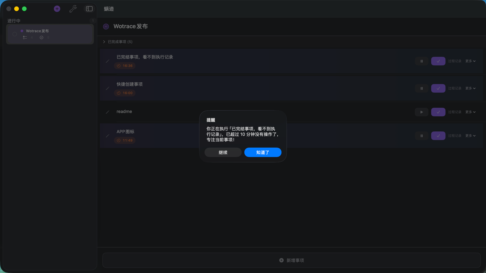

# 蜗迹 (WoTrace)

<p align="center">
  
</p>

一款提醒你思考，维护你专注的过程管理工具

## 痛点与解决方案

### 痛点
做事时不高效主要两个原因
1. 没有想清楚要怎么做就开始做，导致走了弯路
2. 做事的时候被打断：包括主动的和被动的

之前我的解法是：用flomo记录思路，比如现在有哪些事情要做，哪些已经做完了。
但实现起来常常是忘记记录。

### 解决方案

- 可以录入目标和你认为的关键步骤（支持动态添加）
- 开启一个事项后，如果15分钟没有更新进展就会提醒你去思考当前是不是陷入低效，当前是不是注意力被转移了

## 功能特性

- **目标管理** - 创建和管理工作目标
- **事项追踪** - 创建任务列表，支持子任务
- **快速录入** - 事项行直接编辑，焦点离开自动保存
- **键盘操作** - 回车保存内容并在下方创建新事项，Cmd+N 新建事项
- **事项移动** - 左侧按钮支持事项上移和删除
- **过程记录** - 运行中的事项默认展开过程记录，焦点离开自动保存
- **计时功能** - 实时追踪任务执行时间，支持暂停/继续
- **预计时间** - 为任务设定预计完成时间
- **执行历史** - 记录每次执行的时间段
- **提醒机制** - 后台定时检查，支持自定义提醒间隔（15分钟提醒）
- **已完成事项** - 查看和管理已完成的任务

## 界面截图



## 技术栈

- SwiftUI (macOS)
- Swift 5.9+
- macOS 13.0+
- Xcode 15.0+

## 数据存储

- 存储位置：`~/Library/Application Support/WoTrace/data.json`

## 每日总结原理

### 数据模型（三层结构）

```
DailySummary（每日总结）
├── date: Date                    // 日期
├── totalDurationSeconds: Int     // 当日总耗时
└── hourlySummaries: [HourlySummary]  // 按小时分组
         └── HourlySummary
              ├── hour: Int       // 小时 (0-23)
              └── tasks: [TaskSummary]
                    └── TaskSummary
                         ├── goalName: String      // 目标名称
                         ├── taskTitle: String      // 任务标题
                         ├── durationSeconds: Int   // 耗时
                         ├── executionStartTime    // 开始时间
                         └── executionEndTime      // 结束时间
```

### 核心原理：动态计算而非存储

每日总结**不是持久化存储的数据**，而是通过 `generateDailySummary(for:)` 方法**实时从 WorkItem 数据计算得出的**。

### 计算过程

1. **遍历所有 WorkItem**（目标）
2. **遍历每个任务**（包含进行中 + 已完成的）
3. **遍历每个 ExecutionSession**（执行记录）
4. **按日期过滤**：只保留目标日期的记录
5. **按小时分组**：根据 `session.startTime` 的小时数
6. **合并同名任务**：同一小时内相同目标+任务名称的记录会**合并时长**（累加），时间范围取最早~最晚
7. **排序**：每小时内的任务按耗时降序排列

### 数据来源

从 `workItems` 中获取原始数据：
- `workItem.items` - 进行中的任务
- `workItem.completedItems` - 已完成的任务
- 每个任务有 `executionSessions`（执行会话）记录实际耗时

### 显示特点

- **时间轴视图**：按小时展开，每个小时显示任务列表和耗时进度条
- **统计卡片**：总时长、任务数、活跃小时数
- **合并显示**：同小时内同名称的任务会合并为一条记录

这样设计的好处是：总结数据始终与原始执行记录保持一致，修改/删除执行记录后重新打开总结会自动反映最新状态。

## 安装/下载

### 从源码构建

```bash
# 克隆仓库
git clone https://github.com/Valentino-cai/WoTrace.git
cd WoTrace

# 构建 Release 版本并生成 DMG
./build.sh
```

### 系统要求

- macOS 13.0+
- Xcode 15.0+

## 许可证

MIT License
